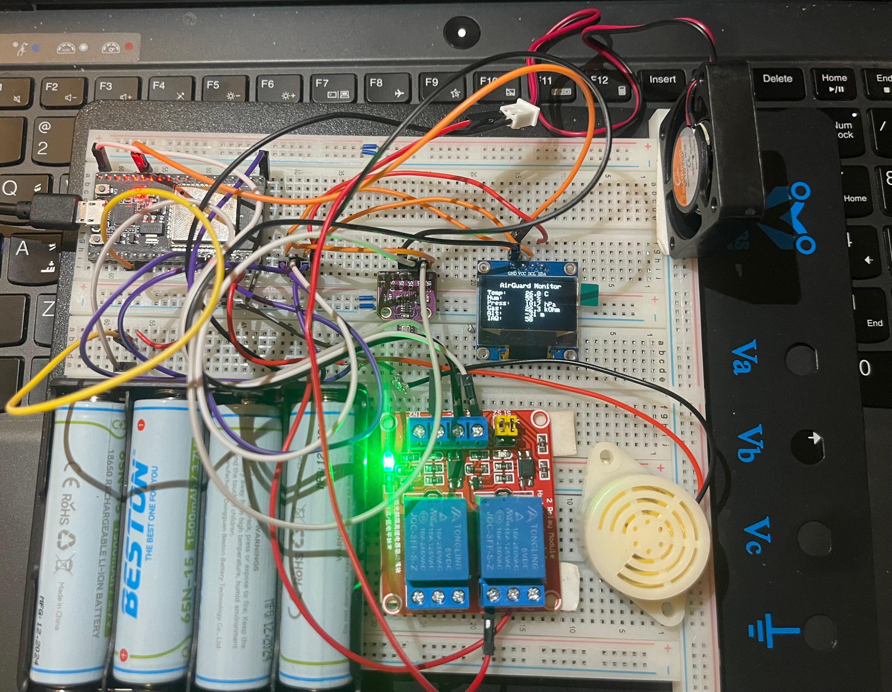
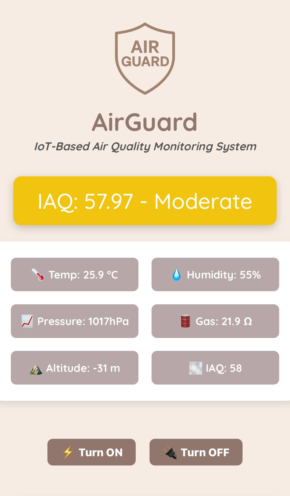
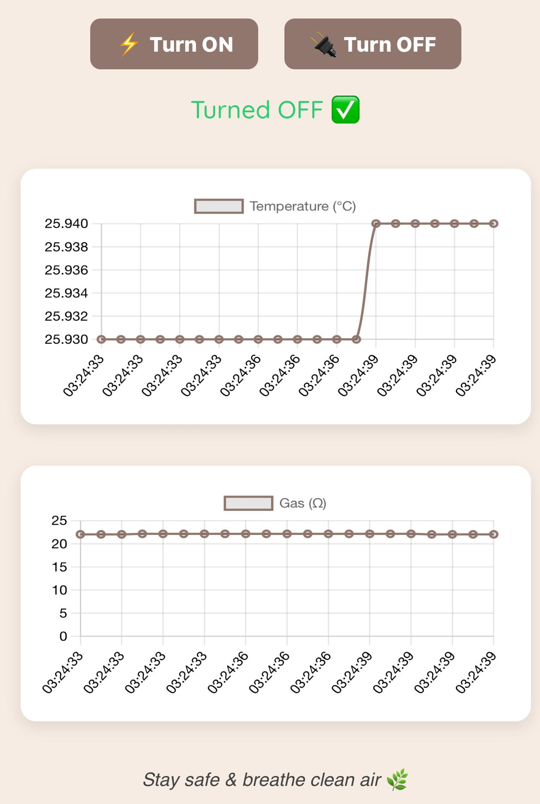

<p align="center">
  
</p>

# 🌬️ AirGuard – Smart Air Quality Monitor & Alert System

> 🛡️ *Breathe Easy. Live Safe.*

---

## 🧠 Overview

AirGuard is a smart air quality monitoring and response system that:
- 🧪 Measures **temperature**, **humidity**, **pressure**, **gas resistance**, **altitude**, and **IAQ** using a BME680 sensor
- 📟 Displays readings on an OLED screen
- 🌐 Sends data via **MQTT over TLS** to a Node.js server connected to EMQX Broker
- 💻 Provides a real-time **web dashboard** for live monitoring and manual override
- 🔔 Automatically activates a **buzzer** and **fan** if air quality is poor

---

## 📊 Features

✅ Real-time Air Quality Monitoring  
✅ IAQ Classification + Color Indicators  
✅ Auto-triggered Fan & Buzzer  
✅ Manual ON/OFF Control via Dashboard  
✅ MQTT Secure TLS Communication  
✅ OLED Display for Local Readings  
✅ Interactive Charts & UI Enhancements  

---

## 🧩 Technologies Used

| Component     | Purpose                              |
|--------------|---------------------------------------|
| ESP32         | Microcontroller (sensor + control)    |
| BME680        | Air quality sensor                    |
| OLED Display  | Onboard screen (I2C)                  |
| Relay Module  | Controls Fan & Buzzer                 |
| EMQX Broker   | Secure MQTT messaging                 |
| Node.js + Socket.io | Backend MQTT Bridge            |
| Chart.js      | Real-time data visualization          |
| Ngrok         | WAN access to localhost server        |

---

## 🛠️ Setup Instructions

### 🚀 1. Hardware Setup
<p align="center">
  
</p>

## 🔁 2. MQTT Logic

- 📤 ESP32 publishes sensor data every 3s to:
  - `bme680/temperature`, `humidity`, `pressure`, `gas`, `altitude`, `iaq`
  - `airguard/iaq_label`

- 📥 Subscribes to `airguard/power`:
  - When received, it turns fan/buzzer ON or OFF manually
  - Manual mode lasts 10 seconds, then auto-control resumes

- 🔁 Auto Logic:
  - IAQ ≥ 3 (Unhealthy) or gas < 15 → Turns fan/buzzer ON
  - Otherwise → Keeps OFF

---

## 🧠 3. Backend Server (Node.js)

```bash
cd Web_App/Backend
npm install
node server.js
```

✅ Features:
- Subscribes to EMQX broker (`mqtts://`)
- Parses messages and updates real-time data object
- Sends data to web client via `socket.io`
- Emits `control` commands back to MQTT topic on button click

---

## 🌐 4. Web Dashboard

- Start the backend server:
  ```bash
  node server.js
  ```

- Expose it using **ngrok**:
  ```bash
  ngrok http 3000
  ```

- Copy the HTTPS link from ngrok and open it in your browser.

---

## 📽️ Demo & Screenshots

### 🌐 Web Dashboard Interface

| Dashboard                         | Live Graphs & Controls           |
|----------------------------------|----------------------------------|
|  |  |

---

### 🎥 Full System Demo Video  

> [▶️ Click to Watch Demo](Demo_Video/demo.mp4)

Enjoy the full functionality of **AirGuard** in action — from real-time sensor monitoring and auto/manual fan & buzzer control, to visual analytics and alerts!

---

## 👥 Team Members

- **Mohamed Abdallah** – 221001719 – [@MohamedEldairouty](https://github.com/MohamedEldairouty)  
- **Maya Hossam** – 221000302 – [@MayaMorsy](https://github.com/MayaMorsy)  
- **Habiba Amr** – 221000287 – [@HabibaGhoneim](https://github.com/HabibaGhoneim)  
- **Jana Ayman** – 221000985

---

## 🚀 How to Run

1. Upload Arduino code to ESP32  
2. Start EMQX broker (we used public EMQX Cloud)  
3. Start Node backend `node server.js`  
4. Run `ngrok http 3000` and access the public URL  

---

## 📝 License

This project is for academic use only.  
All assets and content belong to the **AirGuard Team © 2025**.

---

> ⚠️ Stay aware. Stay safe. Your health matters.  
> Made with ❤️ by Team AirGuard.
