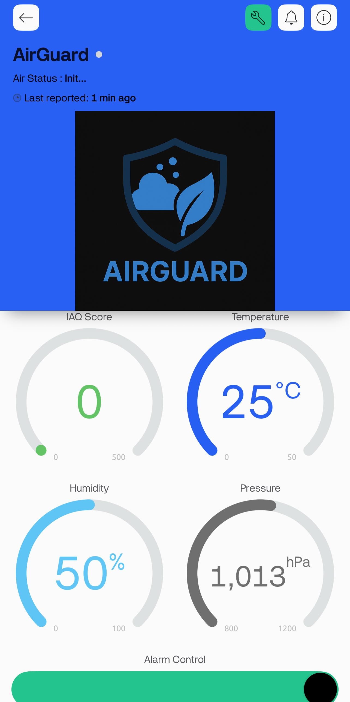

  

# AirGuard – IoT-Based Air Quality Monitoring System

*AirGuard* is a real-time indoor air quality monitoring system built using ESP32, the BME680 sensor, and the Blynk IoT platform. It monitors environmental conditions such as IAQ (Indoor Air Quality Index), temperature, humidity, and pressure. When poor air quality is detected, the system triggers an alarm and sends push notifications to the user.

---

## Features

- Live IAQ monitoring using BME680 and BSEC library
- Real-time data visualization via Blynk mobile app
- Automatic buzzer alarm and user-controlled alert system
- Push notifications when air quality becomes hazardous
- Simple and compact hardware design using ESP32

---

## Technologies Used

- *ESP32* – Main microcontroller
- *BME680* – Gas, temperature, humidity, and pressure sensor
- *Bosch BSEC v1.8.1492* – Advanced IAQ estimation
- *Blynk IoT Platform* – Mobile app dashboard & notifications
- *Arduino IDE* – Code development and uploading
- *C++ (Arduino)* – Firmware language

---

## Hardware Components

| Component        | Description                        |
|------------------|------------------------------------|
| ESP32 Dev Board  | Wi-Fi enabled microcontroller      |
| BME680 Sensor    | Air quality & environment sensing  |
| Active Buzzer    | Audio alert for poor air quality   |
| Breadboard + Wires | For prototyping connections      |

---

## Screenshots

### Live IAQ Monitoring via Blynk App

### System Overview with ESP32 & BME680

---

## Demo Video

▶ [Click to watch the demo](Demo_Video/airguard_demo.mp4)

---

## How to Use

1. Clone this repo and upload AirGuard_BSEC_Blynk.ino to your ESP32.
2. Connect the hardware as shown in the wiring diagram.
3. Open the Blynk app and monitor IAQ data in real-time.
4. When IAQ exceeds the threshold, receive alerts and buzzer triggers.

---

## License

This project is licensed under the MIT License.

---

## Authors

- Mohamed Abdallah Eldairouty  
- Maya Hossam
- Habiba Amr
- Jana Ayman
